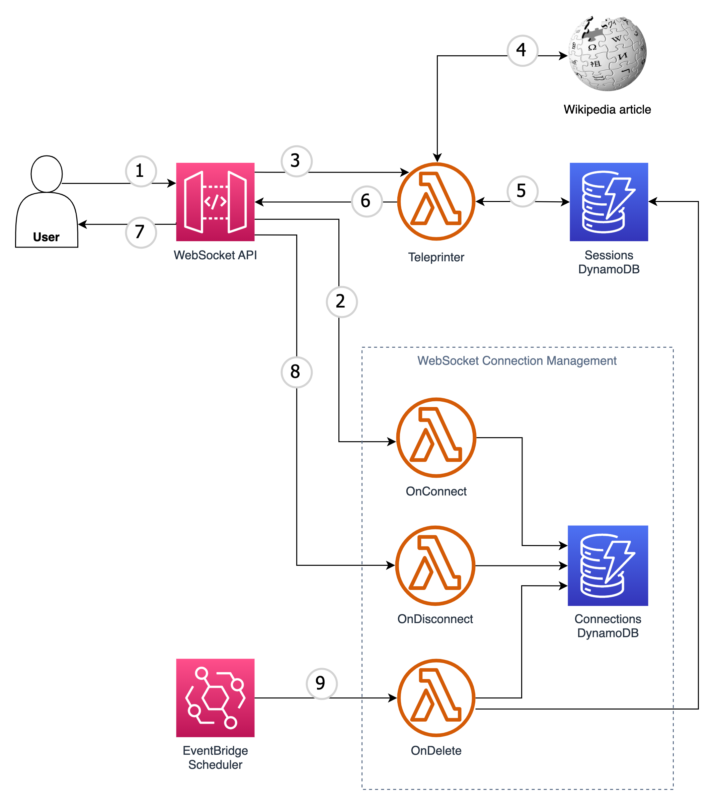
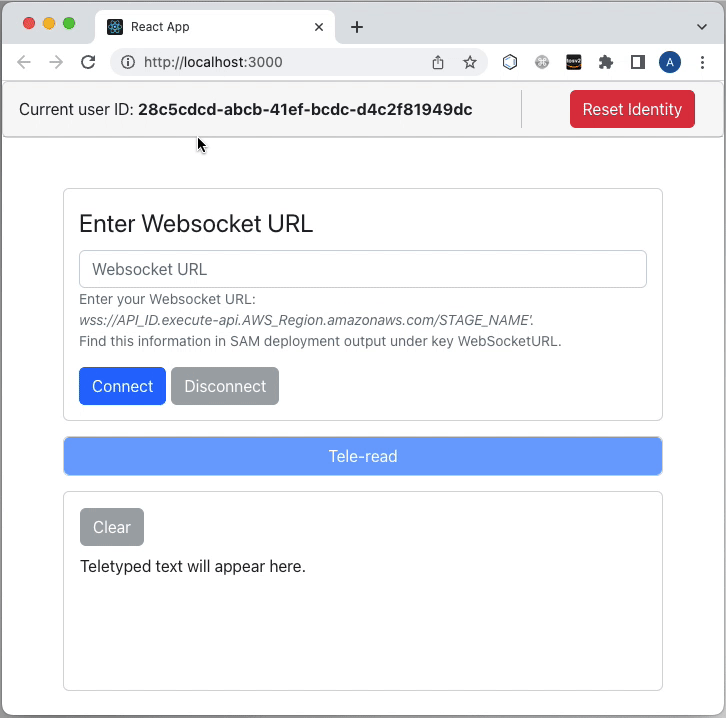

# WebSocket API session management

This project creates a sample app for demonstrating how to keep anonymous user context when using WebSocket APIs.

The goal is to demonstrate how to handle reconnects without losing user context.



## Project structure

This project contains Backend, which you can deploy with AWS SAM `template.yml`, located in the root of the repository. `handlers` directory contains all AWS Lambda functions' source code. `ws-sessions-frontend` directory contains React-based Frontend, which is optional for deployment.

## Requirements

* [Create AWS Account](https://portal.aws.amazon.com/gp/aws/developer/registration/index.html) in case you do not have it yet or log in to an existing one
* An IAM user or a Role with sufficient permissions to deploy and manage AWS resources
* [AWS CLI](https://docs.aws.amazon.com/cli/latest/userguide/install-cliv2.html) installed and configured
* [Git Installed](https://git-scm.com/book/en/v2/Getting-Started-Installing-Git)
* [AWS Serverless Application Model](https://docs.aws.amazon.com/serverless-application-model/latest/developerguide/serverless-sam-cli-install.html) (AWS SAM) installed
* [Python](https://www.python.org/downloads/) for changing AWS Lambda functions' code
* [NPM](https://www.npmjs.com/get-npm) for changing the frontend code (React)


## Deployment instructions

The project contains Backend and Frontend. You can deploy Backend only. The deployment of Frontend is optional. You can use a hosted Frontend for testing application [here-INSERT_THE_LINK]() and refer to the code in `ws-sessions-frontend` to understand how it works under the hood. Alternatively, you can deploy the React-based Frontend locally or to AWS.

### Backend

1. Open a terminal and create a new directory, which you will use to clone the repository from GitHub.
1. Clone GitHub repository:
    ``` bash
    git clone https://github.com/aws-samples/websocket-sessions-management
    ```
1. Change directory to the cloned repository:
    ``` bash
    cd websocket-sessions-management
    ```
1. Make sure that your terminal can access AWS resources. Use AWS SAM to deploy the backend resources:
    ``` bash
    sam build && sam deploy --guided
    ```
1. When prompted:
    * Specify a stack name
    * Choose AWS Region
    * Allow SAM CLI to create IAM roles with the required permissions.

    Once you have finished the setup, SAM CLI will save the specified settings in configuration file samconfig.toml so you can use `sam deploy` for quicker deployments.
1. Note the WebSocketURL value in the output of `sam deploy --guided` command. You will need this value for the Frontend later.

### Frontend

#### Option 1: Use hosted Frontend

AWS provides you with hosted React-based Frontend. Simply open [this link](https://main.d2ygdotzvem6pv.amplifyapp.com/).

#### Option 2: Deploy frontend Frontend locally

To test Frontend on your local machine, you can deploy the React app locally. To do this, follow these steps:

1. Make sure you have npm installed:
    ``` bash
    npm -v
    ```
1. Navigate to `ws-sessions-frontend` directory:
    ``` bash
    cd ws-sessions-frontend
    ```
1. Start the Frontend:
    ``` bash
    npm start
    ```
    The command will open React app in your default browser. If it does not happen automatically, navigate to http://localhost:3000/ manually.


## How it works



1. Notice that the app has generated a random user ID for you on startup. The app shows the user ID above in the header.

1. Paste the WebSocket URL into the text field. You can find the URL in the console output after you have successfully deployed your SAM template. Alternatively, you can navigate to AWS Management Console (make sure you are in the right region), select the API you have recently deployed, go to `Stages`, select the deployed stage and copy the `WebSocket URL` value.

1. Press `Connect` button. The app opens WebSocket connection.

1. Press `Tele-read` to start receiving the Wikipedia article character by character. New characters will appear in the second half of the screen as they arrive.

1. Press `Disconnect` button to close WebSocket connection. Reconnect again and press `Tele-read` button. Your session resumes from where you stopped.

1. Press `Reset Identity` button. The app closes the WebSocket connection and changes the user ID. Press `Connect` button and `Tele-read` button again and your character feed starts from the beginning.

