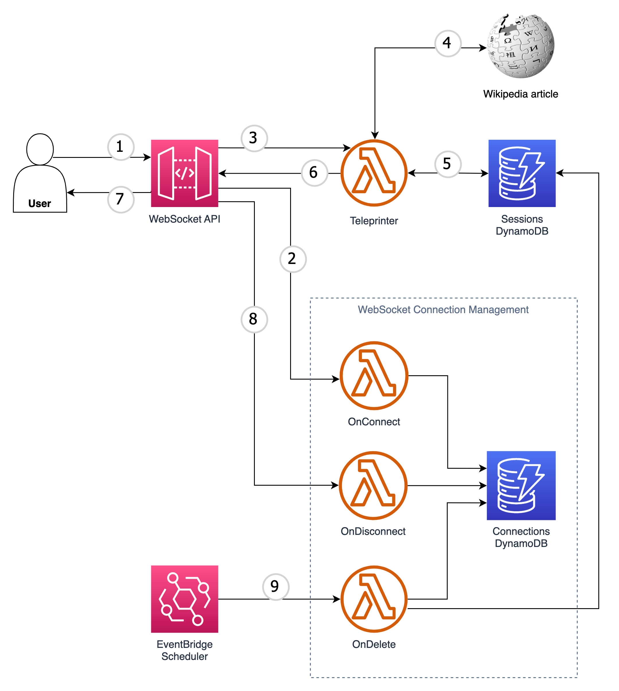
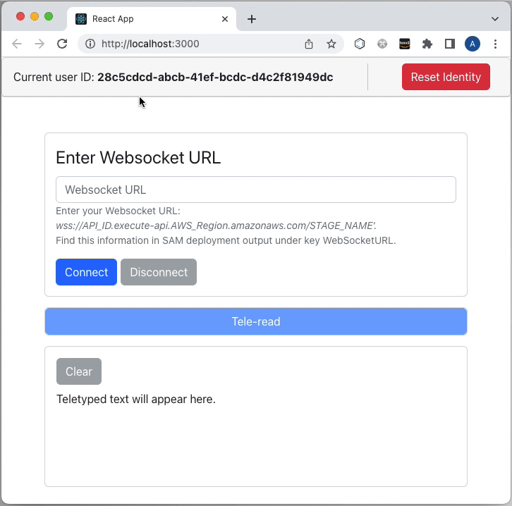

# WebSocket API session management

*This repository is a part of the [blog post](https://aws.amazon.com/blogs/compute/managing-sessions-of-anonymous-users-in-websocket-api-based-applications/). Check it out for more information.*

This project creates a sample app for demonstrating how to keep anonymous user context when using WebSocket APIs.

The goal is to demonstrate how to handle reconnects without losing user context.



## What changed since the [original blog post](https://aws.amazon.com/blogs/compute/managing-sessions-of-anonymous-users-in-websocket-api-based-applications/)

If you came here from the blog post, the architecture in the diagram (two DynamoDB tables, OnConnect/OnDisconnect/Teleprinter Lambdas, EventBridge-driven OnDelete sweep, cursor-resume on reconnect) is unchanged. The pieces that diverge from the post are mostly about how the user id reaches the backend.

* **Identity no longer travels in `Sec-WebSocket-Protocol`.** The post passes the browser-generated user id through the `Sec-WebSocket-Protocol` header (`new WebSocket(wsUri, userId)`). That works, but it lets any client claim any user id ([issue #13](https://github.com/aws-samples/websocket-sessions-management/issues/13)). The sample now uses a Cognito Identity Pool with unauthenticated identities: the frontend gets short-lived guest IAM credentials, SigV4-signs the `$connect` URL, and the `$connect` route is protected by `AuthorizationType: AWS_IAM`. `OnConnect` reads the user id from `requestContext.identity.cognitoIdentityId`, which AWS vouches for. The anonymous reconnecting user experience is the same; the id just isn't forgeable.
* **IdentityId lives in `localStorage`, not `sessionStorage`.** Cognito IdentityIds are stable per browser, so persisting across tabs and reloads is the intended behavior. "Reset Identity" clears it and triggers a fresh `GetId` on the next connect.
* **Stage uses `AutoDeploy: true`.** The post's template uses a static `AWS::ApiGatewayV2::Deployment` snapshot. With AutoDeploy, route changes (such as flipping `$connect` to `AWS_IAM`) take effect on the live stage automatically.
* **Lambda runtime bumped to `python3.13`.** Python 3.9 is past end-of-support and Lambda blocks new function creates on it.
* **DynamoDB tables use `PAY_PER_REQUEST`.** The sample is bursty and mostly idle, so on-demand fits better than the provisioned 5/5 in the post.
* **Frontend dependencies modernized.** Migrated to Next.js 16 with the App Router and shipped as a static export.

The post's "Serving authenticated users" note still applies. To accept signed-in users instead of guests, swap the Identity Pool's unauthenticated role for an authenticated one and feed it tokens from a Cognito User Pool (or any other federated identity provider).

## Project structure

This project contains Backend, which you can deploy with AWS SAM `template.yml`, located in the root of the repository. `handlers` directory contains all AWS Lambda functions' source code. `ws-sessions-frontend` directory contains React-based Frontend, which is optional for deployment.

## Requirements

* [Create AWS Account](https://portal.aws.amazon.com/gp/aws/developer/registration/index.html) in case you do not have it yet or log in to an existing one
* An IAM user or a Role with sufficient permissions to deploy and manage AWS resources
* [AWS CLI](https://docs.aws.amazon.com/cli/latest/userguide/install-cliv2.html) installed and configured
* [Git Installed](https://git-scm.com/book/en/v2/Getting-Started-Installing-Git)
* [AWS Serverless Application Model](https://docs.aws.amazon.com/serverless-application-model/latest/developerguide/serverless-sam-cli-install.html) (AWS SAM) installed
* [Python](https://www.python.org/downloads/) for changing AWS Lambda functions' code
* [NPM](https://www.npmjs.com/get-npm) for changing the frontend code (React)


## Deployment instructions

The project contains Backend and Frontend. You can deploy Backend only. The deployment of Frontend is optional. Refer to the code in `ws-sessions-frontend` to understand how it works under the hood, or deploy the React-based Frontend locally or to AWS.

### Backend

1. Open a terminal and create a new directory, which you will use to clone the repository from GitHub.
1. Clone GitHub repository:
    ``` bash
    git clone https://github.com/aws-samples/websocket-sessions-management
    ```
1. Change directory to the cloned repository:
    ``` bash
    cd websocket-sessions-management
    ```
1. Make sure that your terminal can access AWS resources. Use AWS SAM to deploy the backend resources:
    ``` bash
    sam build && sam deploy --guided
    ```
1. When prompted:
    * Specify a stack name
    * Choose AWS Region
    * Allow SAM CLI to create IAM roles with the required permissions.

    Once you have finished the setup, SAM CLI will save the specified settings in configuration file samconfig.toml so you can use `sam deploy` for quicker deployments.
1. Note the WebSocketURL value in the output of `sam deploy --guided` command. You will need this value for the Frontend later.
1. Note the IdentityPoolId value in the same output. The Frontend uses it to obtain anonymous guest IAM credentials and SigV4-sign the WebSocket connect request. The $connect route is configured with `AuthorizationType: AWS_IAM`, so the user id (`requestContext.identity.cognitoIdentityId`) is vouched for by AWS rather than asserted by the client.

### Frontend

To test Frontend on your local machine, you can deploy the React app locally. To do this, follow these steps:

1. Make sure you have Node.js 20.9+ and npm installed:
    ``` bash
    node -v
    npm -v
    ```
1. Navigate to `ws-sessions-frontend` directory:
    ``` bash
    cd ws-sessions-frontend
    ```
1. Install dependencies:
    ``` bash
    npm install
    ```
1. Configure the Cognito Identity Pool ID. Create `.env.local` in `ws-sessions-frontend/` with the `IdentityPoolId` value from the SAM outputs:
    ``` bash
    NEXT_PUBLIC_IDENTITY_POOL_ID=<region>:<uuid>
    ```
    Next.js inlines `NEXT_PUBLIC_*` variables at build time, so this works for both `npm run dev` and the static export.
1. Start the development server:
    ``` bash
    npm run dev
    ```
    Open http://localhost:3000/ in your browser. The app supports hot reload.

To preview the production static bundle locally:

``` bash
npm run build       # produces ws-sessions-frontend/out/
npx serve out       # serves the static bundle on http://localhost:3000
```

> **Note:** This frontend is configured as a Next.js [static export](https://nextjs.org/docs/app/guides/static-exports) (`output: "export"` in `next.config.mjs`), so `npm start` (which expects a Node runtime server) does not apply. Deploy the contents of `out/` to any static host (S3 + CloudFront, Amplify Hosting, GitHub Pages, etc.).


## How it works



1. Notice that the app has generated a random user ID for you on startup. The app shows the user ID above in the header. The ID is the Cognito IdentityId for this browser, allocated on first connect from the Identity Pool's unauthenticated identities and cached in `localStorage` so it survives reloads.

1. Paste the WebSocket URL into the text field. You can find the URL in the console output after you have successfully deployed your SAM template. Alternatively, you can navigate to AWS Management Console (make sure you are in the right region), select the API you have recently deployed, go to `Stages`, select the deployed stage and copy the `WebSocket URL` value.

1. Press `Connect` button. The app opens WebSocket connection.

1. Press `Tele-read` to start receiving the Wikipedia article character by character. New characters will appear in the second half of the screen as they arrive.

1. Press `Disconnect` button to close WebSocket connection. Reconnect again and press `Tele-read` button. Your session resumes from where you stopped.

1. Press `Reset Identity` button. The app closes the WebSocket connection and changes the user ID. Press `Connect` button and `Tele-read` button again and your character feed starts from the beginning.

